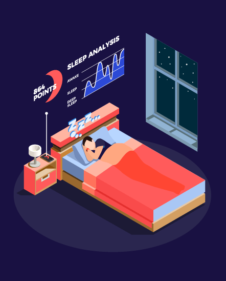
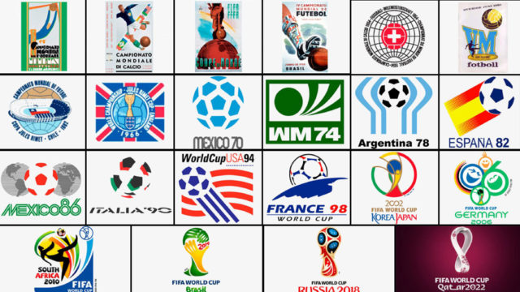

# DataScience

# Aquí voy a ir compartiendo los Proyectos que vaya haciendo y, estén relacionados con el Análisis de Datos, comenzando por lo más sencillo para terminar por proyectos más complicados y sofisticados.
# TODOS los consejos, sugerencias, anotaciones, indicaciones, críticas (siempre que sean CONSTRUCTIVAS), comentarios, etc son y serán BIENVENIDOS.
<a href="mailto:loquelojonove1975@gmail.com" target="_blank" title="Email" rel="noopener"></i></a>
  
# PROYECTO 01 "Sleep Health and lifestyle".
# Este es el 1er Proyecto de Análisis de Datos ( sin contar el del Trabajo final de Máster) que he realizado.
# En los sucesivos proyectos iré incluyendo más herramientas, librerías, procesos y procedimientos, hasta llegar a la elaboración completa y pormenorizada de un Análisis junto con el Modelo de Machine Learning para su predicción, además de otros aspectos.

# Análisis del dataset "Sleep Health and lifestyle".
# Para la elaboración de este análisis he usado:
# - PANDAS y
# - Google COLAB
# El informe final lo he generado tanto en PDF como en HTML.
# Espero vuestros feedbacks y poder seguir mejorando paso a paso.
# Muchas gracias a todos.

  

  
# PROYECTO 02 "PRUEBA TÉCNICA DE DELOITTE: KPI Churn rate".
# Este es el RESULTADO de la prueba técnica (24h de tiempo límite) que tuve que hacer en el proceso de selección de Deloitte, para el puesto de Data Science.
# Debido al poco tiempo que tuve para la realización de la misma, ya que la tuve que hacer mientras estaba trabajando, el resultado es mejorable pero, estoy contento y satisfecho del resultado final que obtuve. Espero vuestros feedbacks y poder seguir mejorando paso a paso.
# En los sucesivos proyectos iré incluyendo más herramientas, librerías, procesos y procedimientos, hasta llegar a la elaboración completa y pormenorizada de un Análisis junto con el Modelo de Machine Learning para su predicción, además de otros aspectos.

# Análisis del dataset "AbandonoEmpleados.csv".
# Para la elaboración de este análisis he usado:
# - PANDAS 
# - Matplotlib
# - Scikit-learn y
# - Google COLAB
# El informe final lo he generado tanto en PDF como en HTML.
# Muchas gracias a todos.

<a target="_blank" href="02_PDF_KPI_churn_EMartinez_Deloitte(correccion).pdf"> PRUEBA TÉCNICA DE DELOITTE: KPI Churn rate. PROYECTO 02.</a>

  

# PROYECTO 03 "WEBSCRAPING CON SELENIUM: ANÁLISIS MUNDIALES DE FÚTBOL".
# Este es el 2º Proyecto de Análisis de Datos que he realizado en el que he incluido el trabajo de Webcscraping, para la búsqueda de los datos.
# En los sucesivos proyectos iré incluyendo más herramientas, librerías, procesos y procedimientos, hasta llegar a la elaboración completa y pormenorizada de un Análisis junto con el Modelo de Machine Learning para su predicción, además de otros aspectos.
# Ya estoy más cerca de este objetivo. 

# Análisis (webscraping) para la extracicón de los datos de la web dataset "(https://en.wikipedia.org/wiki/{año_mundial}_FIFA_World_Cup)".
# Para la elaboración de este análisis he usado:
# - SELENIUM y
# - Visual Studio Code
# El informe final lo he generado en formato csv.
# Muchas gracias a todos.

<a target="_blank" href="01MUNDIALES_FUTBOL_CON_SELENIUM.ipynb"> ANÁLISIS DE MUNDIALES DE FÚTBOL REALIZADO CON SELENIUM. PROYECTO 03.</a>

